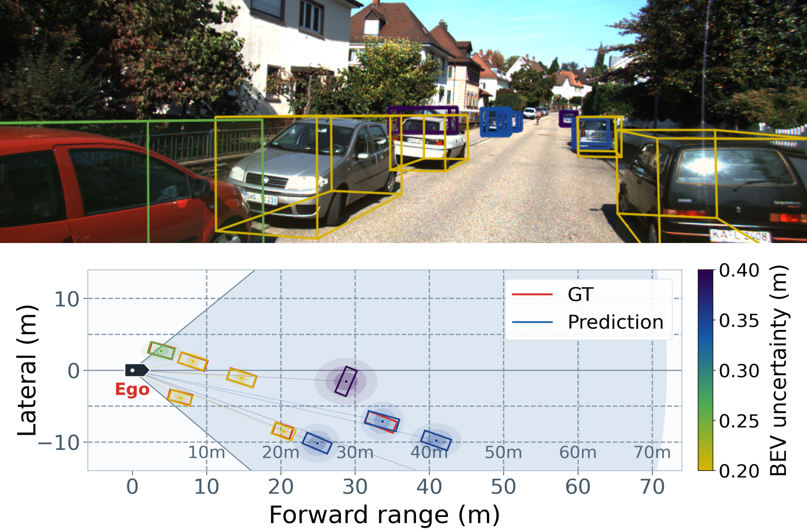
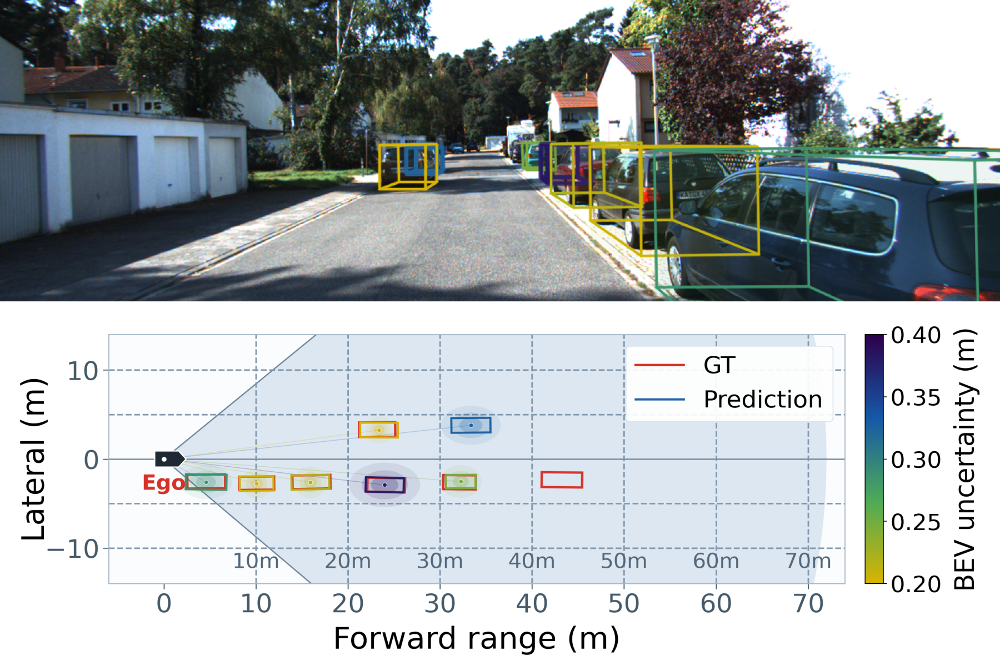
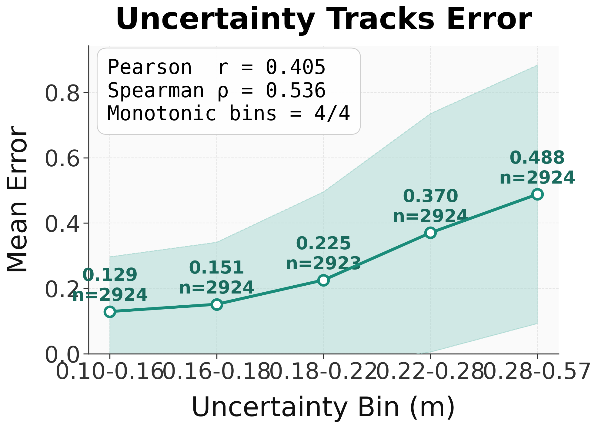
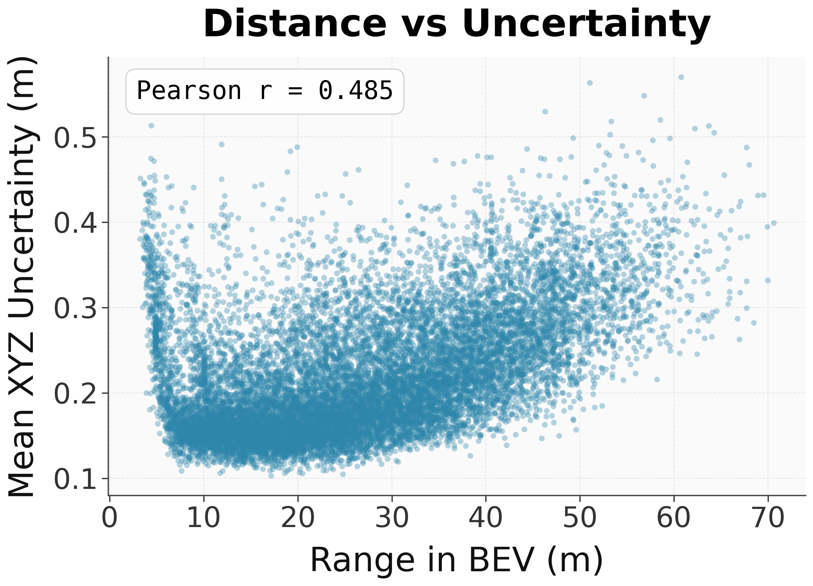

# GLENet Gaussian 3D Bounding Box Uncertainty

This repository is forked from
[Eaphan/GLENet](https://github.com/Eaphan/GLENet), which is built on
OpenPCDet. The original GLENet code estimates **label uncertainty** with a
generative model. This fork extends that idea to **prediction-time 3D bounding
box uncertainty**: a detector predicts a 3D box, a confidence score, and an
explicit spatial uncertainty for the predicted box.

## What Is In This Repository

The project has two connected parts:

1. **Original GLENet label uncertainty pipeline**
   - Train a CVAE-style object generator in `cvae_uncertainty/`.
   - Repeatedly sample predictions for each ground-truth object.
   - Compute per-object box variance as label uncertainty.
   - Write the uncertainty back into KITTI/Waymo info and database pickle files.

2. **Added Gaussian 3D bbox uncertainty detector**
   - Add `VoxelRCNNGaussian` as a detector wrapper.
   - Add a Gaussian uncertainty ROI head for Voxel R-CNN.
   - Predict both box residuals and log variance for each RoI.
   - Train the uncertainty branch with an aleatoric Gaussian regression loss.
   - Export, visualize, and analyze per-box uncertainty.

## Added Work

The main added work in this fork is:

- **Problem extension**: move from GLENet's label uncertainty to
  prediction-time 3D bounding box uncertainty.
- **Gaussian uncertainty head**: add a branch that predicts `rcnn_reg_std`,
  interpreted as log variance for the box regression output.
- **Uncertainty-aware regression**: use the aleatoric objective
  `exp(-s) * L_reg + 0.5 * s`, with `s` clamped to `[-5, 5]`.
- **Confidence modulation**: use the uncertainty branch to modulate the ROI
  classification confidence.
- **Uncertainty export and visualization**: return `pred_uncertainty` during
  post-processing, dump `uncertainty_xyz`, and provide scripts for BEV/image
  visualization and uncertainty-error analysis.

The original GLENet method, its CVAE label uncertainty idea, and the OpenPCDet
framework are upstream work and should be cited separately.

## Results And Visualization

This fork puts extra emphasis on making the predicted 3D bbox uncertainty
visible and measurable. The visualization scripts render the same prediction in
two complementary views:

- image-space 3D boxes, where box color reflects predicted uncertainty;
- BEV boxes, where the translucent ellipse around each prediction shows the
  spatial uncertainty magnitude.

<p align="center">
  
</p>

<p align="center">
  
</p>

The analysis scripts also check whether the uncertainty output is meaningful
rather than only visually plausible. On the exported KITTI validation
predictions used for the current analysis, higher predicted uncertainty
correlates with higher BEV localization error.

<p align="center">
  
</p>

Distance is another expected source of ambiguity in LiDAR detection. The
Gaussian output follows that intuition: farther objects tend to have larger
predicted spatial uncertainty.

<p align="center">
  
</p>

These figures are generated from the tools under `tools/` and
`tools/uncertain_influence.py`; see [Visualization And Analysis](#visualization-and-analysis).

## Implementation Details

The added Gaussian branch is intentionally separated from the original GLENet
label-uncertainty workflow.

| Component | Main files | Role |
| --- | --- | --- |
| Detector wrapper | `pcdet/models/detectors/voxel_rcnn_gaussian.py` | Adds Gaussian post-processing and returns `pred_uncertainty` with each selected prediction. |
| ROI uncertainty head | `pcdet/models/roi_heads/voxelrcnn_gaussian_iou_head.py` | Predicts box residuals and log variance (`rcnn_reg_std`) for each RoI. |
| Gaussian ROI template | `pcdet/models/roi_heads/roi_head_template_gaussian.py` | Decodes uncertainty-aware box predictions when the head emits extra uncertainty channels. |
| Config | `tools/cfgs/kitti_models/GLENet_VR_gaussian.yaml` | Enables `VoxelRCNNGaussian` and `VoxelRCNNGaussianIoUHead`. |
| Uncertainty export | `tools/test_gaussian.py`, `tools/eval_utils/eval_utils_gaussian.py` | Writes `result_with_uncertainty_epoch_*.pkl` with `uncertainty_xyz`. |
| Visualization | `tools/vis_pic_uncertain.py`, `tools/make_paper_uncertainty_cases.py` | Draws image-space boxes, BEV uncertainty ellipses, and paper-style stacked cases. |
| Error analysis | `tools/uncertain_influence.py` | Measures whether uncertainty correlates with BEV localization error. |

The Gaussian regression objective is:

```text
L = exp(-s) * L_reg + 0.5 * s
```

where `s` is the predicted log variance. In code, `s` is clamped to `[-5, 5]`
for stability. The first term reduces the penalty of high-error samples when
the model predicts higher uncertainty; the second term prevents the model from
inflating uncertainty everywhere.

During inference, the model decodes the predicted log variance into metric
uncertainty and keeps the uncertainty associated with the boxes selected by
NMS. The exported `uncertainty_xyz` values are used by the visualization and
analysis scripts.

## Key Files

```text
cvae_uncertainty/
  model.py                         # CVAE generator for label uncertainty
  dataset.py                       # object-level data for GLENet uncertainty generation
  mapping_uncertainty.py           # repeated predictions -> variance map
  change_gt_infos.py               # inject uncertainty into KITTI info/dbinfo files

pcdet/
  models/detectors/voxel_rcnn_gaussian.py
  models/roi_heads/voxelrcnn_gaussian_iou_head.py
  models/roi_heads/voxelrcnn_kl_label_iou_head.py
  models/model_utils/model_nms_utils.py

tools/
  cfgs/kitti_models/GLENet_VR.yaml
  cfgs/kitti_models/GLENet_VR_gaussian.yaml
  train.py
  test.py
  test_gaussian.py
  eval_utils/eval_utils_gaussian.py
  vis_pic_uncertain.py
  vis_uncertainty_trend.py
  make_paper_uncertainty_cases.py
  uncertain_influence.py

assets/readme/
  # selected qualitative and quantitative figures shown in this README

visualization_outputs/
  # generated visualization folders are kept here
```

## Environment And Build

This codebase follows the original GLENet/OpenPCDet dependency stack and builds
several CUDA/C++ extension modules under `pcdet/ops`. A known working setup for
the Gaussian branch is Python 3.8, PyTorch 1.10.x, CUDA 11.x, and a compatible
`spconv` wheel.

Create and activate an environment:

```bash
conda create -n glenet-gaussian python=3.8 -y
conda activate glenet-gaussian
python -m pip install --upgrade pip setuptools wheel
```

Install PyTorch for your CUDA version. For example, with CUDA 11.3:

```bash
pip install torch==1.10.2+cu113 torchvision==0.11.3+cu113 \
  -f https://download.pytorch.org/whl/torch_stable.html
```

Install Python dependencies:

```bash
pip install -r requirements.txt
```

Install `spconv`. Pick the wheel that matches the CUDA runtime used by PyTorch:

```bash
# Example for CUDA 11.3
pip install spconv-cu113
```

If your setup needs the original GLENet/OpenPCDet style `spconv` 1.x build,
install that before building this repository. This fork's `pcdet/utils/spconv_utils.py`
supports both `import spconv.pytorch as spconv` and legacy `import spconv`.

Build the local CUDA/C++ extensions from the repository root:

```bash
python setup.py develop
```

Quick import check:

```bash
python - <<'PY'
import torch
import pcdet
from pcdet.ops.iou3d_nms import iou3d_nms_cuda
from pcdet.ops.roiaware_pool3d import roiaware_pool3d_cuda
print("torch:", torch.__version__, "cuda:", torch.version.cuda)
print("pcdet build ok")
PY
```

Build notes:

- `nvcc --version` should be compatible with the CUDA version used by PyTorch.
- Re-run `python setup.py develop` after changing PyTorch/CUDA/spconv versions.
- If extension compilation fails after an environment change, remove `build/`
  and rebuild.
- Generated `.so` files, `build/`, and `pcdet/version.py` are intentionally
  ignored by git.
- Most detector configs use paths relative to `tools/`, so training and testing
  commands should be run from `tools/`.

## Dataset And Symlink Setup

The code expects KITTI at `data/kitti`. To keep large datasets outside the git
repository, place the real KITTI files somewhere else and link them into this
layout.

Download the official KITTI 3D object detection data from the
[KITTI object benchmark](https://www.cvlibs.net/datasets/kitti/eval_object.php?obj_benchmark=3d).
For LiDAR-only experiments, the required parts are left images, Velodyne point
clouds, calibration files, and training labels. Road planes are optional but
useful for ground-truth sampling; the original GLENet README links
[train_planes.zip](https://drive.google.com/file/d/1d5mq0RXRnvHPVeKx6Q612z0YRO1t2wAp/view?usp=sharing).

Recommended external layout:

```text
/path/to/KITTI/object/
  ImageSets/                 # optional if using the split files shipped here
  training/
    calib/
    image_2/
    label_2/
    planes/                  # optional
    velodyne/
  testing/
    calib/
    image_2/
    velodyne/
```

Create the links from the repository root:

```bash
bash tools/scripts/setup_kitti_symlinks.sh /path/to/KITTI/object
```

The script keeps any existing `data/kitti/ImageSets` split files, links
`training/` and `testing/` into `data/kitti`, and also creates:

```text
cvae_uncertainty/kitti -> ../data/kitti
```

That second link is needed by several original GLENet/CVAE utilities that read
paths such as `kitti/kitti_infos_train.pkl` while running inside
`cvae_uncertainty/`.

After the links are ready, generate the standard OpenPCDet KITTI metadata:

```bash
python -m pcdet.datasets.kitti.kitti_dataset create_kitti_infos \
  tools/cfgs/dataset_configs/kitti_dataset.yaml
```

This creates files such as:

```text
data/kitti/kitti_infos_train.pkl
data/kitti/kitti_infos_val.pkl
data/kitti/kitti_infos_test.pkl
data/kitti/kitti_dbinfos_train.pkl
data/kitti/gt_database/
```

For original GLENet uncertainty-aware training, the training info files should
contain `annos["uncertainty"]`, and dbinfo entries should contain `uncertainty`.
The Gaussian prediction-time bbox uncertainty branch can be trained from the
standard KITTI info files, because it learns the predicted box uncertainty from
the detection regression loss.

## Model Weights And Metadata

Large model weights and generated pickle files are not tracked by git. Keep
third-party/upstream assets and this fork's Gaussian checkpoints separate.

### Upstream GLENet Assets

These are original GLENet resources, not the Gaussian bbox uncertainty weights
from this fork.

The upstream GLENet repository provides uncertainty metadata:

- `kitti_infos_train_wconf_v5.pkl`
- `kitti_dbinfos_train_wconf_v5.pkl`

and pretrained detector checkpoints:

- `GLENet_S.pth`
- `GLENet_C.pth`
- `GLENet_VR.pth`

Download them with:

```bash
pip install gdown
bash tools/scripts/download_upstream_glenet_assets.sh all
```

The script saves upstream detector checkpoints under:

```text
checkpoints/upstream/glenet/
```

and upstream uncertainty metadata under:

```text
data/kitti/kitti_infos_train_wconf_v5.pkl
data/kitti/kitti_dbinfos_train_wconf_v5.pkl
```

To use the upstream uncertainty metadata with configs that expect
`kitti_infos_train.pkl` and `kitti_dbinfos_train.pkl`, either update the config
file names or link the downloaded files:

```bash
cd data/kitti
mv kitti_infos_train.pkl kitti_infos_train_standard.pkl
mv kitti_dbinfos_train.pkl kitti_dbinfos_train_standard.pkl
ln -s kitti_infos_train_wconf_v5.pkl kitti_infos_train.pkl
ln -s kitti_dbinfos_train_wconf_v5.pkl kitti_dbinfos_train.pkl
cd ../..
```

### Gaussian Weights From This Fork

The Gaussian 3D bbox uncertainty checkpoints are this fork's added work and
should be released separately from upstream GLENet weights. Recommended local
placement:

```text
checkpoints/gaussian/GLENet_VR_gaussian_epoch80.pth
```

After publishing the checkpoint, use a release URL or model-hosting URL in this
form:

```bash
mkdir -p checkpoints/gaussian
wget -O checkpoints/gaussian/GLENet_VR_gaussian_epoch80.pth <your_gaussian_weight_url>
```

Then evaluate with:

```bash
cd tools
python test_gaussian.py \
  --cfg_file cfgs/kitti_models/GLENet_VR_gaussian.yaml \
  --batch_size 4 \
  --ckpt ../checkpoints/gaussian/GLENet_VR_gaussian_epoch80.pth
```

## Original GLENet Label Uncertainty Workflow

Train the CVAE generator with folds:

```bash
cd cvae_uncertainty
mkdir -p logs
exp_id=exp20
GPU_IDS="${GPU_IDS:-0,1}"
NUM_GPUS="${NUM_GPUS:-2}"
for fold in $(seq 0 9); do
  sed "s@# FOLD_IDX: 0@FOLD_IDX: ${fold}@" cfgs/${exp_id}_gen_ori.yaml > cfgs/${exp_id}_gen.yaml
  CUDA_VISIBLE_DEVICES="${GPU_IDS}" bash scripts/dist_train.sh "${NUM_GPUS}" \
    --cfg_file cfgs/${exp_id}_gen.yaml \
    --tcp_port 18889 \
    --max_ckpt_save_num 10 \
    --workers 1 \
    --extra_tag fold_${fold}
done
```

Run repeated stochastic prediction:

```bash
cd cvae_uncertainty
exp_id=exp20
for fold in $(seq 0 9); do
  sed "s@# FOLD_IDX: 0@FOLD_IDX: ${fold}@" cfgs/${exp_id}_gen_ori.yaml > cfgs/${exp_id}_gen.yaml
  sh predict.sh ${exp_id}_gen fold_${fold} 400 0
done
```

Map variance and inject it into KITTI metadata:

```bash
cd cvae_uncertainty
mkdir -p output/uncertainty_dump
python mapping_uncertainty.py
python change_gt_infos.py
```

## Detector Training

Run from `tools/`.

Original GLENet Voxel R-CNN variant:

```bash
cd tools
python train.py --cfg_file cfgs/kitti_models/GLENet_VR.yaml
```

Gaussian prediction-time bbox uncertainty variant:

```bash
cd tools
export CUDA_VISIBLE_DEVICES=<gpu_ids>
bash scripts/dist_train.sh 2 \
  --cfg_file cfgs/kitti_models/GLENet_VR_gaussian.yaml \
  --batch_size 4 \
  --epochs 80 \
  --extra_tag full_gaussian_run
```

The Gaussian head reports losses such as:

- `rcnn_loss_reg_src`: regression term weighted by predicted uncertainty
- `rcnn_loss_reg_log`: log-variance regularization term
- `rcnn_loss_reg`: combined Gaussian regression loss

## Testing And Exporting Uncertainty

Standard detector evaluation:

```bash
cd tools
python test.py \
  --cfg_file cfgs/kitti_models/GLENet_VR_gaussian.yaml \
  --batch_size 4 \
  --ckpt ../checkpoints/gaussian/GLENet_VR_gaussian_epoch80.pth
```

If you trained the model locally with `--extra_tag full_gaussian_run`, the
checkpoint path is usually:

```text
../output/kitti_models/GLENet_VR_gaussian/full_gaussian_run/ckpt/checkpoint_epoch_80.pth
```

Export prediction records with uncertainty:

```bash
cd tools
python test_gaussian.py \
  --cfg_file cfgs/kitti_models/GLENet_VR_gaussian.yaml \
  --batch_size 4 \
  --ckpt ../checkpoints/gaussian/GLENet_VR_gaussian_epoch80.pth
```

The Gaussian export writes records containing:

```text
frame_id
boxes_3d
scores
labels
uncertainty_xyz
```

## Visualization And Analysis

Generated visual outputs are organized under `visualization_outputs/`, which is
ignored by git. Selected figures for the README are copied into `assets/readme/`.

### Export Uncertainty Predictions

First export prediction records that include `uncertainty_xyz`:

```bash
cd tools
python test_gaussian.py \
  --cfg_file cfgs/kitti_models/GLENet_VR_gaussian.yaml \
  --batch_size 4 \
  --ckpt ../checkpoints/gaussian/GLENet_VR_gaussian_epoch80.pth \
  --save_to_file
```

The export writes a pickle containing:

```text
frame_id
boxes_3d
scores
labels
uncertainty_xyz
```

### Per-Frame Qualitative Visualization

Visualize Gaussian uncertainty on KITTI validation frames:

```bash
cd tools
python vis_pic_uncertain.py \
  --cfg_file cfgs/kitti_models/GLENet_VR_gaussian.yaml \
  --ckpt ../checkpoints/gaussian/GLENet_VR_gaussian_epoch80.pth \
  --uncertainty_scale 1.0 \
  --save_dir ../visualization_outputs/vis_full_uncertainty
```

This produces image-space 3D projections and BEV figures. In the BEV view:

- red boxes are GT boxes;
- blue boxes are predictions;
- color and ellipse size indicate predicted spatial uncertainty;
- the colorbar is in meters after decoding the predicted uncertainty.

### Paper-Style Stacked Cases

Build paper-style stacked figures from the full visualization output:

```bash
bash tools/run_paper_cases_test_and_val.sh
```

or directly:

```bash
python tools/make_paper_uncertainty_cases.py \
  --source_dir visualization_outputs/vis_full_uncertainty \
  --save_dir visualization_outputs/vis_full_uncertainty_paper_cases
```

The script stacks camera projection and BEV uncertainty into one figure per
frame. The README examples were selected from these generated case figures.

### Uncertainty-Error Analysis

Run the uncertainty-error analysis on exported predictions:

```bash
python tools/uncertain_influence.py \
  --cfg_file tools/cfgs/kitti_models/GLENet_VR_gaussian.yaml \
  --pred_pkl output/kitti_models/GLENet_VR_gaussian/full_gaussian_run/eval/eval_with_train/epoch_80/val/final_result/data/result_with_uncertainty_epoch_80.pkl \
  --gt_info_pkl data/kitti/kitti_infos_val.pkl \
  --save_dir uncertain_influence/results
```

The main evidence figure is:

```text
uncertain_influence/results/uncertainty_vs_error_bin.png
```

It bins predictions by uncertainty and plots mean BEV error
`error_scalar = 1 - IoU_bev`. A monotonic increase supports the claim that the
predicted uncertainty tracks localization error.

Optional trend plots can also be generated with:

```bash
python tools/vis_uncertainty_trend.py \
  --pred_pkl output/kitti_models/GLENet_VR_gaussian/full_gaussian_run/eval/eval_with_train/epoch_80/val/final_result/data/result_with_uncertainty_epoch_80.pkl \
  --save_dir visualization_outputs/vis_uncertainty_trend_epoch80_full
```

## Current Smoke-Test Status

The Gaussian branch can be smoke-tested with:

- `GLENet_VR_gaussian.yaml` config loading from `tools/`
- KITTI dataloader construction
- one training forward pass with `gt_uncertaintys`
- checkpoint loading from `full_gaussian_run/ckpt/checkpoint_epoch_80.pth`
- one evaluation forward pass returning `pred_uncertainty`

## Attribution

This repository is based on:

- GLENet: "Boosting 3D Object Detectors with Generative Label Uncertainty Estimation"
- OpenPCDet 0.5.2
- spconv

If you use the original GLENet components, please cite:

```bibtex
@article{zhang2023glenet,
    title={GLENet: Boosting 3D object detectors with generative label uncertainty estimation},
    author={Zhang, Yifan and Zhang, Qijian and Zhu, Zhiyu and Hou, Junhui and Yuan, Yixuan},
    journal={International Journal of Computer Vision},
    volume={131},
    number={12},
    pages={3332--3352},
    year={2023}
}
```

## License

The original GLENet/OpenPCDet code is released under the Apache 2.0 license.
Check upstream project licenses for inherited components and third-party
dependencies.
